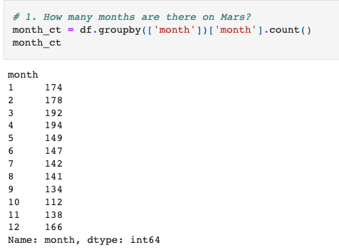
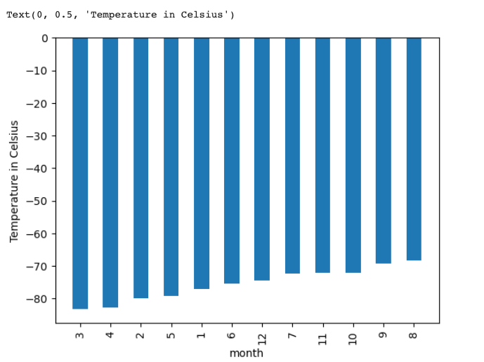
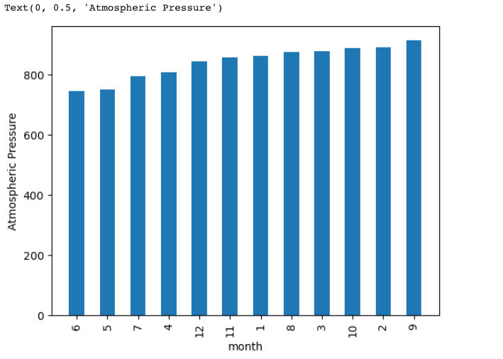
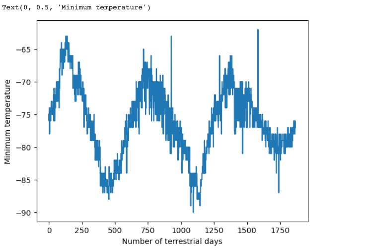

# Mars Data

## **Mars Data Project**

### To help Robin scrape, organize, analyze, and visualize the data collected from the Mars news articles and weather data.

## **Results**

- **Scraped and analyzed Mars weather data.**
  
  _**1. How many months exist on Mars?**_
   
    
  
  
  _**2. How many Martian days' worth of data are there?**_
  
  
  
  
  _**3. Which month, on average, has the lowest temperature? The highest?**_
  
    The third month on average has the coldest minimum temperature on Mars with the eight month being the warmest. 
  
  
  
  _**4. Which month, on average, has the lowest atmospheric pressure? The highest?**_
  
    The Atmospheric pressure on average is lowest in the sixth month with the highest in the ninth month.
  
  
  
  _**5. How many terrestrial days exist in a Martian year? A visual estimate within 25% was made.**_
  
    The distance from peak to peak is roughly 1425-750, or 675 days. A year on Mars appears to be about 675 days from the plot. 
    
  
